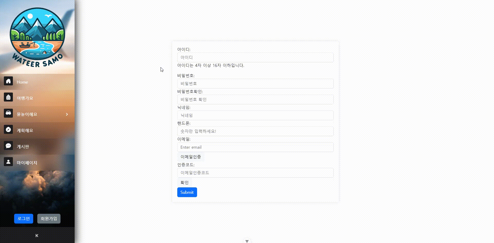

# WATEER SAMO

# 여름 피서를 위한 물놀이 정보 제공 웹사이트

## 기획의도

여름 방학이나 휴가 때 간편하게 계획을 세우고 이를 공유할 수 있는 공간을 만들어보자.

## 기대효과

간단한 조작을 통해 여러 사이트를 거치지 않고도 쉽고 효과적으로 계획을 세우고 공유할 수 있다.

## Diagram

### class Diagram

1. attraction(관광지, 찜)
   

1-1. attraction-detail

2. board (게시판)
   

2-2. board-detail

3. member (회원)
   

4. oauth (카카오 로그인)
   

5. ocean (해수욕장)
   

6. plan (계획)
   

7. water (계곡, 하천)
   

### usecase Diagram

### 게시판 관리

### 관광지 검색

### 기본 관리

### 메인화면 관리

### 물놀이

### 여행 계획 등록

## 시연

### 회원가입

이메일 인증을 통해서 이메일 인증이 완료된 회원만 회원가입을 완료할 수 있습니다.

### 로그인(일반로그인)

사이트에 가입한 계정을 통해 로그인을 할 수 있습니다.
로그인 시에 jwt를 발급받습니다.

### 카카오로그인(동일 이메일 계정 이미 존재할 때)

카카오 계정을 통해서 로그인을 할 수 있습니다.

### 카카오 로그인(이메일 계정 존재하지 않을 때)

카카오 계정을 통해서 로그인을 했을 때, 사이트 내 아이디가 존재하지 않는다면
사이트 내 회원가입 후 이용할 수 있습니다.

### 마이페이지(일반회원)

.gif>)
마이페이지에서 회원정보를 조회하고 수정할 수 있습니다.

### 마이페이지(관리자)

.gif>)
관리자의 경우 추가적으로 회원들을 관리할 수 있습니다.

### 관광지조회&리뷰

타입에 맞게 관광지 조회를 하고 해당 관광지에 평점과 리뷰를 남길 수 있습니다.

### 관광지 찜 기능

원하는 관광지를 찜 목록에 추가, 삭제할 수 있습니다.

### 계획세우기

본인만의 계획을 만들고 추가할 수 있습니다.

### 경로탐색& 계획수정

작성한 계획의 경로를 탐색할 수 있고 상황에 따라서 수정도 가능합니다.

### 계획공유

본인의 계획을 친구들에게 공유할 수 있습니다.

### 해수욕장 조회

지역별로 해수욕장을 조회하고 해당 해수욕장에 관한 정보를 얻을 수 있습니다.

### 계곡&하천 조회

지역별로 계곡이나 하천을 조회할 수 있고 해당 글에 리뷰를 남길 수 있습니다.

### 게시글 조회

회원이 아닌 사용자도 게시글을 조회할 수 있습니다.

### 게시글 작성

게시글 작성은 회원만 가능하며 링크나 사진을 첨부하여 작성할 수 있습니다.

### 게시글 수정/삭제

본인이 작성한 게시글은 수정/삭제가 가능합니다.

### 댓글작성

게시글에 댓글을 작성할 수 있습니다.

### 비회원 게시판 이용

비회원의 경우 게시글의 조회는 가능하지만 댓글이나 게시글작성은 허용되지 않습니다.

### 회원 홈화면

회원과 비회원 모두 홈 화면에서 현재 인기 있는 관광지와 랜덤 추첨 관광지를 보여줍니다.
회원의 경우 추가적으로 내가 찜한 관광지와 여행 계획을 볼 수 있습니다.
